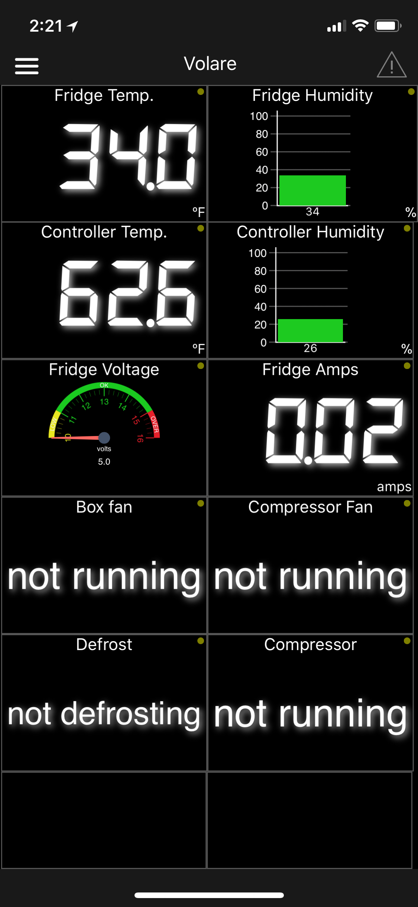

# signalk-stainless-lobster-fridge
SignalK node server plugin that reads data from a Stainless Lobster Fridge Optimiztier via USB

To install, go to the node server App Store or run `npm install signalk-stainless-lobster-fridge`.

Then go to the Plugin Configuration in node server, enable it and enter the USB device path for your optimizer.



Example SignalK Full Tree:

```
"environment" {
  "inside": {
    "refrigerator" : {
      "boxFan" : {
        "$source" : "stainless",
        "timestamp" : "2017-12-23T02:10:07.047Z",
        "value" : 0
      },
      "current" : {
        "$source" : "stainless",
        "value" : 0.02,
        "timestamp" : "2017-12-23T02:10:07.047Z"
      },
      "compressorStatus" : {
        "$source" : "stainless",
        "value" : "off",
        "timestamp" : "2017-12-23T02:10:07.046Z"
      },
      "relativeHumidity" : {
        "value" : 0.688,
        "timestamp" : "2017-12-23T02:10:07.047Z",
        "meta" : {
          "units" : "ratio",
          "description" : "Relative humidity in zone"
        },
        "$source" : "stainless"
      },
      "temperature" : {
        "timestamp" : "2017-12-23T02:10:07.047Z",
        "value" : 278.55,
        "$source" : "stainless",
        "meta" : {
          "description" : "Temperature",
          "units" : "K"
        }
      },
      "controllerTemperature" : {
        "timestamp" : "2017-12-23T02:10:07.047Z",
        "value" : 290.15,
        "$source" : "stainless"
      },
      "compressorStatusNumber" : {
        "value" : 0,
        "timestamp" : "2017-12-23T02:10:07.046Z",
        "$source" : "stainless"
      },
      "voltage" : {
        "value" : 13.6,
        "timestamp" : "2017-12-23T02:10:07.047Z",
        "$source" : "stainless"
      },
      "compressorFan" : {
        "$source" : "stainless",
        "timestamp" : "2017-12-23T02:10:07.047Z",
        "value" : 0
      },
      "controllerHumidity" : {
        "$source" : "stainless",
        "value" : 0.28,
        "timestamp" : "2017-12-23T02:10:07.047Z"
      },
      "defrostStatus" : {
        "$source" : "stainless",
        "timestamp" : "2017-12-23T02:10:07.046Z",
        "value" : 0
      }
    }
  }
}
```
